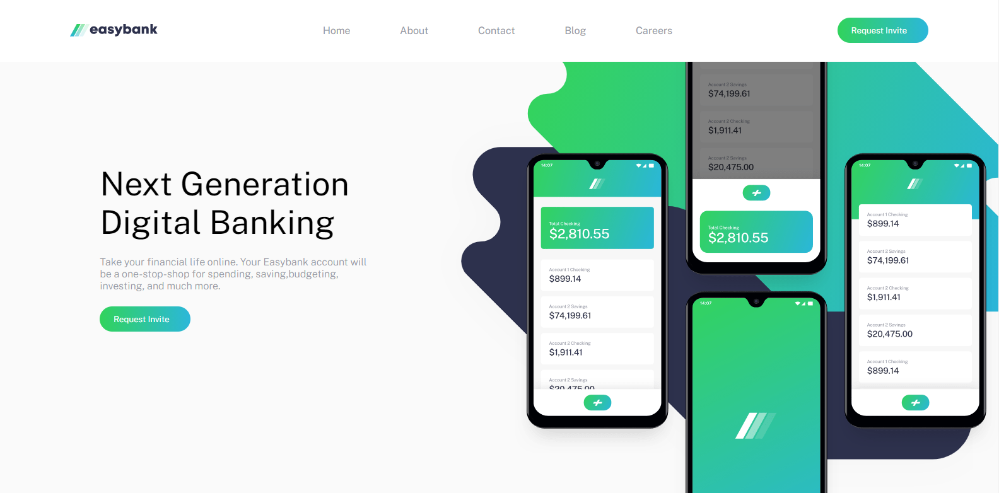

# Frontend mentor Easybank landing Page

#### Coded by Arya Anish

###### I have coded this challange. Please say how is it?

###### You can like my page on [Frontend Mentor](https://www.frontendmentor.io) here's the [link](https://www.frontendmentor.io/solutions/responsive-easybank-landing-page-jCYVm2FSn) please like it

***
 

# Preview

`Thanks for support and thanks for reading`  

# How to use or copy

##### Step 1. Go to [Hyper or any terminal](https://hyper.is/) ` make sure you have git installed `
##### Step 2. cd to any drive 

_Like this and hit enter_

##### Step 3. Type `git clone https://github.com/AryaAnish121/easybank.git` and hit Enter

##### 4. All done, just go and use freely
